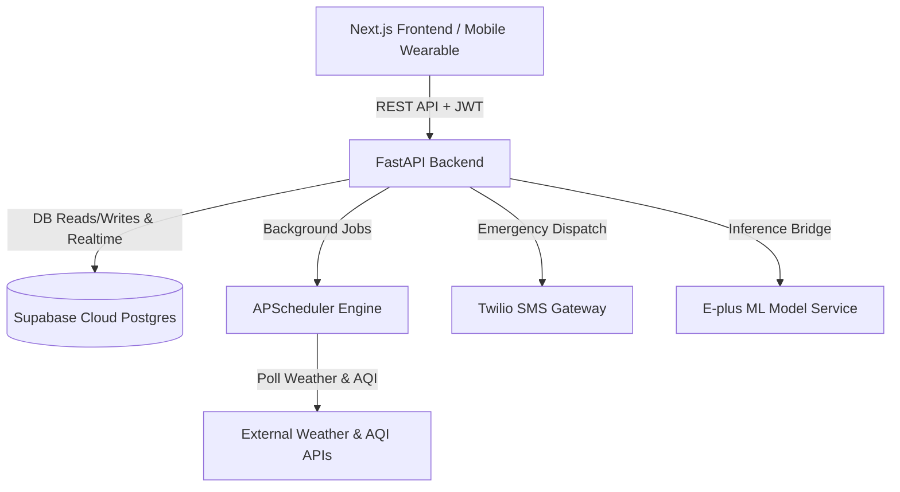

# PRAHARI / E+ Companion Backend API 🛡️⚡

**Continuous Wearable Biometric & Environmental Multi-Modal Risk Engine**  
*Problem Statement: SIH26181 — AI-powered personal health companion with real-time, privacy-preserving health monitoring.*

---

## 🌟 Overview

The **E+ Companion Backend** is a high-performance, asynchronous REST API powered by **FastAPI** and **Supabase (PostgreSQL)**. It manages continuous biometric telemetry, runs the multi-modal risk scoring engine, orchestrates environmental hazard ingestion (heat index & AQI), handles emergency SMS escalations via Twilio, and links with cranial EEG seizure classification models.

### Key Capabilities:
- 🔐 **Dual Auth Engine:** Passwordless OTP phone verification, email development bypass, and JWT access tokens.
- 📊 **Telemetry Ingestion Pipeline:** High-throughput batch biometric ingestion (`POST /ingestion/biometrics`) evaluating heart rate, SpO2, and skin temperature.
- ⚡ **Multi-Modal Risk Engine:** Automated composite risk scoring (0–100) factoring in live biometric readings, local environmental indices (Heat Index, AQI), and EEG neurological seizure states.
- 🧠 **EEG Inference Bridge:** Direct endpoint `POST /eeg/predict-risk` running 16-channel EEG feature extraction and Random Forest classification.
- 🚨 **Incident & Alert Dispatch:** Automated alert triggering with priority routing via Twilio SMS and push notifications with acknowledgment tracking.
- ⏰ **Background Jobs:** Built-in APScheduler polling external weather/AQI APIs and managing alert escalations independent of user requests.

---

## 🏗️ Architecture



---

## 🚀 Quick Start

### 1. Prerequisites
- Python 3.10+ (Python 3.11 or 3.13 recommended)
- Supabase account & project

### 2. Installation

```bash
# Clone repository
git clone https://github.com/Avinash7061/E-plus-backend.git
cd E-plus-backend

# Create virtual environment
python3 -m venv venv
source venv/bin/activate   # On Windows: venv\Scripts\activate

# Install dependencies
pip install -r requirements.txt
```

### 3. Environment Configuration

Create a `.env` file in the root directory (based on `.env.example`):

```env
SUPABASE_URL=https://your-project.supabase.co
SUPABASE_KEY=your-supabase-anon-key
SUPABASE_SERVICE_KEY=your-supabase-service-role-key
JWT_SECRET=your-secure-jwt-secret
JWT_ALGORITHM=HS256

# Optional External Services
TWILIO_ACCOUNT_SID=your-account-sid
TWILIO_AUTH_TOKEN=your-auth-token
TWILIO_PHONE_NUMBER=+1234567890
ML_SERVICE_URL=http://localhost:8001
```

### 4. Run Locally

```bash
uvicorn app.main:app --reload --port 8000
```

Once started:
- **API Base:** [http://localhost:8000](http://localhost:8000)
- **Interactive Swagger Docs:** [http://localhost:8000/docs](http://localhost:8000/docs)
- **ReDoc:** [http://localhost:8000/redoc](http://localhost:8000/redoc)

---

## 📋 API Reference

| Method | Endpoint | Description | Auth Required |
| :--- | :--- | :--- | :---: |
| `GET` | `/` | Health check & service status | ❌ |
| `POST` | `/auth/email-login` | Instant email login / registration bypass | ❌ |
| `POST` | `/auth/login` | Phone number login | ❌ |
| `POST` | `/auth/register` | Register new user profile | ❌ |
| `GET` | `/users/me` | Retrieve profile of authenticated user | ✅ |
| `POST` | `/ingestion/biometrics` | Ingest batch biometrics & compute risk | ✅ |
| `POST` | `/eeg/predict-risk` | 16-ch EEG ML prediction & composite risk | ❌ |
| `POST` | `/eeg/sessions` | Initialize new cranial earbud streaming session | ✅ |
| `GET` | `/eeg/users/{user_id}/latest` | Fetch recent EEG predictions for wearer | ✅ |
| `GET` | `/risk/{user_id}/current` | Fetch latest computed risk score | ✅ |
| `GET` | `/risk/{user_id}/history` | Fetch historical risk score trends | ✅ |
| `GET` | `/alerts/{user_id}` | Fetch active alerts and emergency dispatches | ✅ |
| `POST` | `/alerts/{alert_id}/acknowledge` | Acknowledge and resolve incident | ✅ |

---

## 🧪 Running Tests

```bash
pytest tests/ -v
```

---

## 🚢 Deployment (Render / Railway)

### Deploy to Render
1. Create a new **Web Service** on [Render](https://render.com).
2. Connect this GitHub repository (`Avinash7061/E-plus-backend`).
3. Set:
   - **Environment:** `Python 3`
   - **Build Command:** `pip install -r requirements.txt`
   - **Start Command:** `uvicorn app.main:app --host 0.0.0.0 --port $PORT`
4. Add environment variables (`SUPABASE_URL`, `SUPABASE_KEY`, `JWT_SECRET`).

---

## 📄 License
MIT License. Part of the PRAHARI / E+ Companion Health Resilience System.